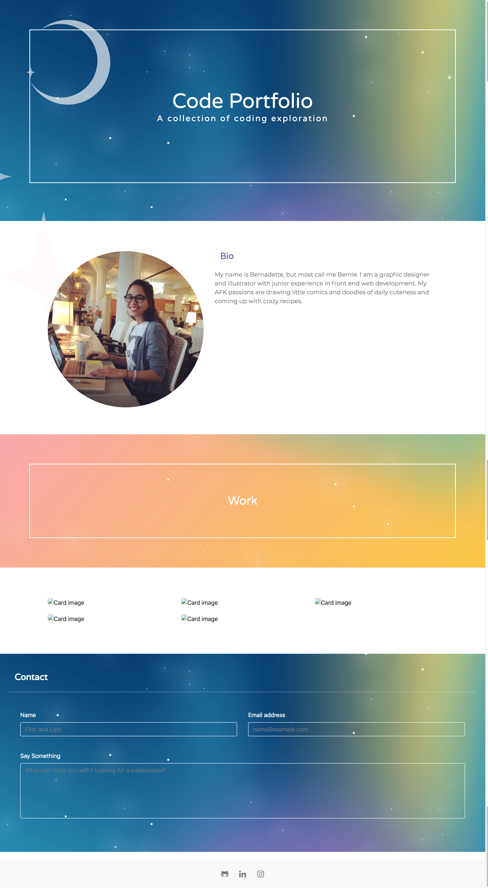

# BernadetteJanuska_Portfolio
A gallery of coding projects. 

https://bmjanuska.github.io/BernadetteJanuska_Portfolio/

Showing some of the work that has been made in the UCF Coding Bootcamp. 

This includes technologies like HTML, CSS, Javascript, Jquery, and Firebase. 

Stay tuned for updates More to come in the future or check out my social feeds in the footer. 

Thank you for stopping by. 

